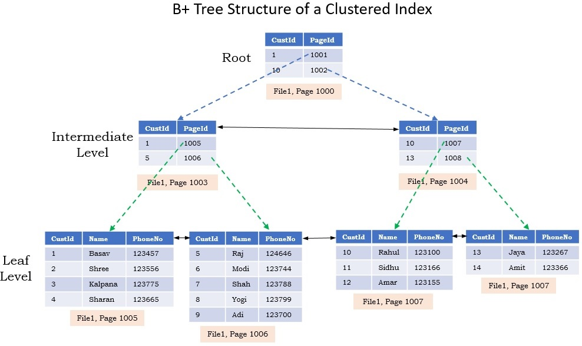

# Recap DI 
## 1. Triggers
### 1.1. How triggers work
A [trigger](https://docs.microsoft.com/en-us/sql/t-sql/statements/create-trigger-transact-sql?view=sql-server-ver15) is a special type of stored procedure that automatically runs when an event occurs in the database server. DML triggers run when a user tries to modify data through a data manipulation language (DML) event. DML events are INSERT, UPDATE, or DELETE statements on a table or view. These triggers fire when any valid event fires, whether table rows are affected or not. If multiple triggers are assigned to a table or view with the same DML event, all of those triggers fire, but the order is non-configurable (unless you use a special sp in modern sql server versions, this is not teaching material).

### 1.2. Progammability
#### After / instead of
**After**  
Specifies when the trigger is fired. In this case it fires after the specified DML events.  
**Instead of**  
Specifies when the trigger is fired. In this case it fires instead of the specified DML events.  

#### Inserted
The inserted table is a special table exclusively accessible in a trigger. It contains every row inserted or updated by an insert event or an update event.

#### Deleted
The deleted table is a special table exclusively accessible in a trigger. It contains every row deleted, or the rows overwritten by an update statement by a delete event or an update event.

#### Update()
Returns a Boolean value that indicates whether an INSERT or UPDATE attempt was made on a specified column of a table or view. UPDATE() is used anywhere inside the body of a Transact-SQL INSERT or UPDATE trigger to test whether the trigger should execute certain actions.

#### Rowcount
Triggers can protect a lot of business rules. It so happens that it may have to access many tables and rows. That's why you want set the 'x rows affected' statements off. This is done by using the following code:
```sql
set nocount on
```

#### Set-oriented
Triggers are fired only once for every DML event. Because these events can effect multiple rows at the same time, you want to program your trigger _set-oriented_. This is done by making use of set-based operators, like _exists_, _intersect_, _union_ and _except_. This is also done by making use of the _inserted_ and _deleted_ tables.

---

## 2. Transactions
### 2.1. A.C.I.D.
#### 1. Atomicity 
   A transaction must be an atomic unit of work; either all of its data modifications are performed, or none of them are performed.

#### 2. Consistency 
When completed, a transaction must leave all data in a consistent state.

#### 3. Isolation   
Modifications made by concurrent transactions must be isolated from the modifications made by any other concurrent transactions. 
   
#### 4. Durability  
After a fully durable transaction has completed, its effects are permanently in place in the system. The modifications persist even in the event of a system failure.
### 2.2. Transaction modes
#### Auto-commit
How transactions are handled in normal DML and DDL events. When an error is found, the whole batch is rollbacked, except when the error is thrown with the raiserror command.
#### Explicit
When transactions are manually managed by making use of _begin transaction_, _commit transaction_ and _rollback transaction_
#### Implicit
A hybrid of auto-commit and explicit. After running DML and DDL events, the transaction has to be committed or rollbacked manually.
### 2.3. Nested
A transaction inside a transaction. 
```sql
@@TRANCOUNT -- returns how nested the transaction is
```

### 2.4. Transaction savepoints
```sql
save transaction t1
```
If you rollback a transaction that has a savepoint, the only statements rollbacked are the ones after the statements. The statements before the savepoint have to be rollbacked or committed too.

---

## 3. Concurrency
### 3.1. Interleaved
Transactions commit their changes one by one, in the transaction. This means one transaction could affect the other.
### 3.2. Simultaneous
Transaction are fully committed or rollbacked at once.
### 3.3. Anomalies
Anomalies are problems that can occur in interleaved transactions.
#### Dirty read
A dirty read occurs when a transaction reads data that is yet uncommitted from another transaction.
#### Non-repeatable read
A non-repeatable read occurs when a transaction tries to read the same data for the second time, but the record it wants to read has been affected by another transaction(delete or update).
#### Phantom
A phantom occurs when a transaction reads the same data in a specific range for the second time, but a different transaction has inserted a row in the same range between the first and second read.
#### Deadlock
A deadlock occurs when 2 transactions are competing for exclusive acces to a resource, while one transaction is preventing it. This results in an infinite standoff, and the only way out is if one of the statements is terminated. The terminated statement in sql server is the one that costs the least to roll back.
### 3.4. Locking
#### Shared lock
The Shared lock prohibits initiation of an Exclusive lock on the affected object. For example, the SELECT statement initiates a Shared lock, and therefore allows multiple queries to access the selected data concurrently, but prevents updates to the records being read, until the SELECT statement completes.
#### Exclusive lock
The Exclusive lock prohibits writing to or reading from the locked object until the transaction holding the Exclusive lock completes. No other locks of any mode are permitted while the Exclusive lock is in effect.
#### Lock granularity
1. Range - All rows in a given range are locked.
2. Table / view - All rows in a table/view are locked.
### 3.5. Transaction isolation levels
The lower the isolation level, the higher the performance.
#### 3.5.1. Read uncommitted
```sql
set transaction isolation level uncommitted
```
Possibly occurring anomalies: Dirty reads, non-repeatable reads, phantoms.

Read uncommitted includes non-committed changes and additions from other transactions. It ignores locks from other transactions.
#### 3.5.2. Read committed
```sql
set transaction isolation level committed
```
Possibly occurring anomalies: Non-repeatable reads, phantoms.

Waits until rows write-locked (x-locked) from other transactions are unlocked.

S-locks: Holds and releases s-locks after each select.

X-locks: Holds x-locks after delete, update or insert. Releases x-locks when the transaction is wrapped up.

#### 3.5.3. Repeatable read
```sql
set transaction isolation level repeatable read
```
Possibly occurring anomalies: Phantom.

Same as read committed, except that s-locks are held until the transaction is wrapped up.

#### 3.5.4. Serializable
```sql
set transaction isolation level serializable 
```
Possibly occurring anomalies: None.

Same as repeatable read, except that instead of applying s-locks to a range, x-locks are applied on that range. This means that inserts in that range have to wait until the transaction is wrapped up. S-locks are treated as they are in read committed.

## 4. Storage and indexing
### 4.1. Storage
SQL server uses _pages_ to store data.

Pages are separated in these parts:
1. Header - including a pointer(index key) to the next page, this is called a linked list
2. Rows
3. Row offset array - describes the sequence of the rows.

If the max amount of data on the page is reached a page split occurs. When a page split occurs, the rows are divided over two pages instead of one. The amount of when a page split occurs can be defined by a user.

Properties of pages:
1. A page is 8 kB
2. Different data types need a different amount of storage space -> varchar(50) > varchar(20)

**logical read** - A page having been read by sql server. Also known as _page read_

**physical read** - A page pulled from the disk to memory. Physicals reads are only needed if the page isn't yet stored in memory, meaning you usually only physically read a page once a session.

**HEAP** - A table without a clustered index

How data in a table is accessed differs in the following possible scenario's:
1. HEAP
2. HEAP + non-clustered index
3. Clustered index
4. Clustered index + non-clustered index

### 4.2. Indexing
Indexes are ways SQL Server looks up data in data pages when queries need that data.
#### Clustered index

Leaf nodes are the corresponding data pages.
#### Non-clustered index
Same as clustered, except the leaf nodes are pointers (the primary key value) to the data pages.

#### Query execution
**Index scan** - Sql server scans all data pages to lookup data.

**Index seek** - Sql server uses an index to lookup data.

**(primary key/unique key) Lookup** - Sql server looks up data in a page based on primary key/unique key values.

**covering index** - An index that covers everything to execute a query.
## 5. Security
### Principals
**Securable**

A db object on wich access can be managed. I.e. tables, vies, columns, sp, etc.

**Privileges**

A db event a user has or hasn't acces to on a given securable. I.e. Select, insert, delete, etc.

**Logins**

A login is how a user logs in to the server. This could be a sql server login or a windows login. Each user has a single login.

**(Server) Role**

Roles are containers that bind certain logins to certain roles in the server. These roles define the set of privileges the user has. Sql server has built-in roles, but you can define roles yourself too.

Rights are managed by using the following commands:
```sql
-- 1. grant access
GRANT <Privilege(select, insert, etc.)> ON <Securable> TO <Principal>
-- 2. disallow access
DENY <Privilege(select, insert, etc.)> ON <Securable> TO <Principal>
-- 3. Remove a previously granted or denied permission
REVOKE <Privilege(select, insert, etc.)> ON <Securable> TO <Principal>
```

### Impersonation
```sql
EXECUTE AS <Principal> -- Sets the execution context of a session. This is a principal.
REVERT -- Switches the execution context back to the caller of the last EXECUTE AS statement.
ORIGINAL_LOGIN() -- Returns the name of the login that connected to the instance of SQL Server. You can use this function to return the identity of the original login in sessions in which there are many explicit or implicit context switches.
system_user -- Allows a system-supplied value for the current login to be inserted into a table when no default value is specified.
user -- Allows a system-supplied value for the database user name of the current user to be inserted into a table when no default value is specified.
```
## 6. Code Generation
This is not included in this recap, since the case study made the author depressed (actually the case study was burned into his brain so much, all he knows is code generation).
